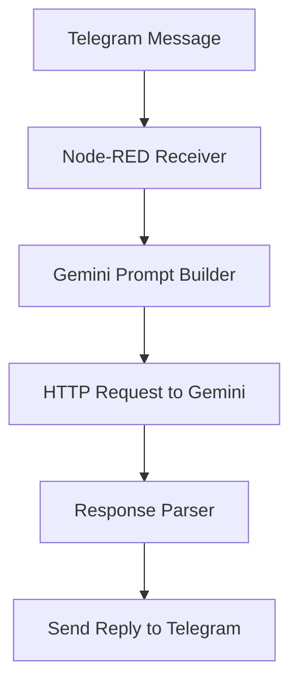
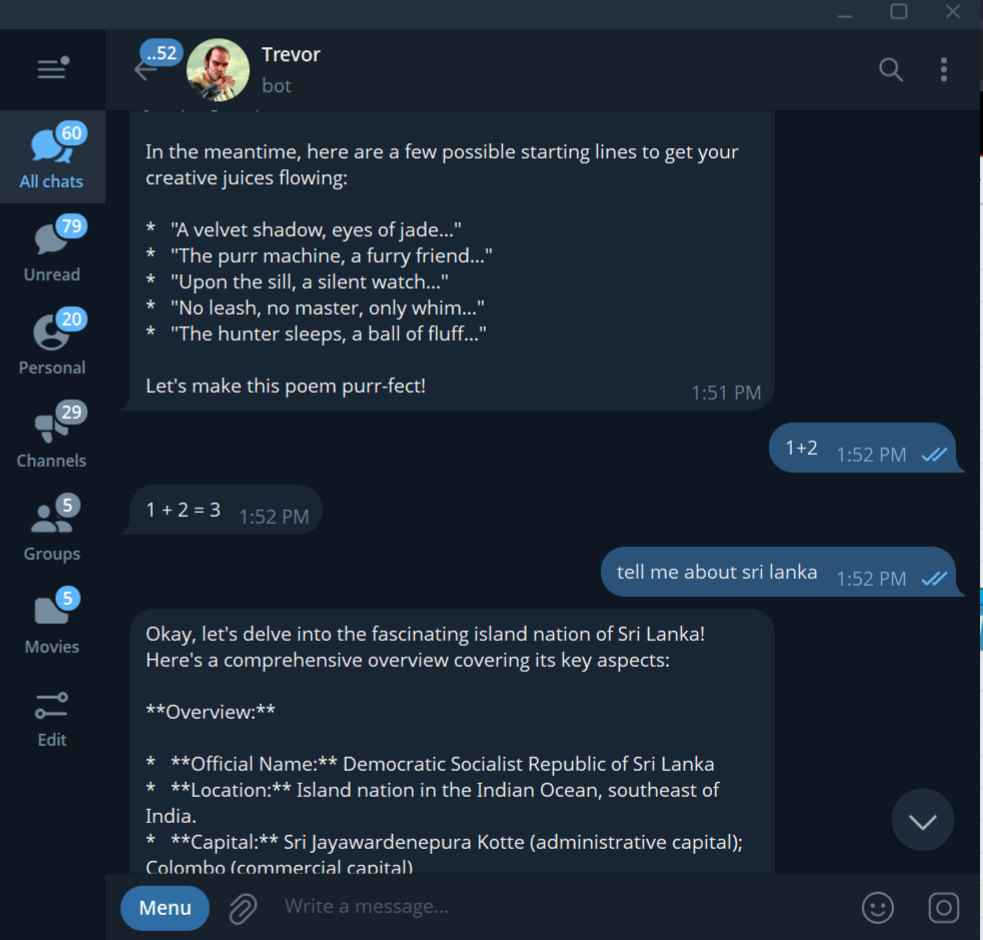
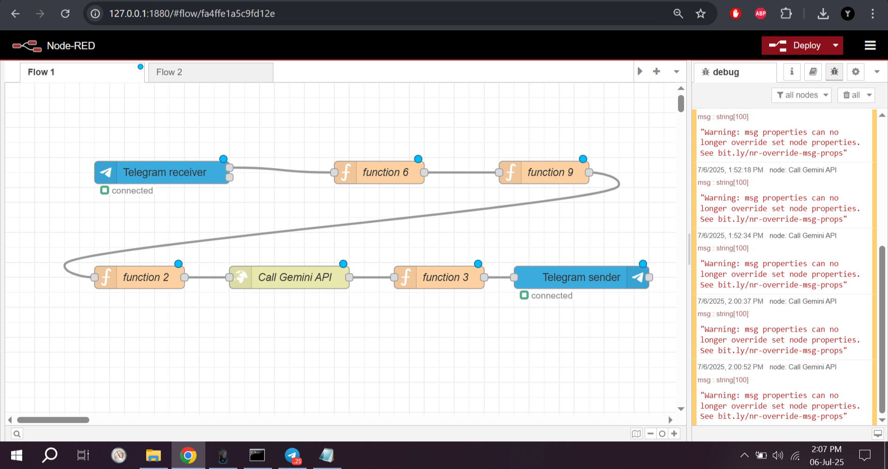

# 🤖 Telegram Chatbot with Gemini AI on Node-RED

A Telegram chatbot powered by Google's Gemini API, hosted on Node-RED. This project enables you to chat with an AI model through Telegram using a flow-based interface.

## 🚀 Features

- Text-to-text Gemini model integration
- Secure API key management (no hardcoded keys)
- Telegram bot interface with message handlers
- Easily customizable and extendable
- Node-RED based, no deep coding required

## 🛠️ Requirements

- Node.js & Node-RED
- Telegram Bot Token
- Gemini API Key (Google Generative AI)
- `node-red-contrib-telegrambot`
- `node-red-contrib-config` (for API key security)

## 📦 Installation

1. Clone the repository:
   ```bash
   git clone https://github.com/yosh-s/Telegram-Chatbot-with-Gemini-AI-on-Node-RED.git
   cd Telegram-Chatbot-with-Gemini-AI-on-Node-RED
   ```

2. Import the `flows.json` into Node-RED.

3. Set up environment variables or use `node-red-contrib-config`.

4. Start Node-RED:
   ```bash
   node-red
   ```

## 🔐 Secure Your API Key

Set your Gemini API Key securely:
- Use `.env` file (not committed)
- Or use `node-red-contrib-config` to store it as a secure global variable.

## 🧠 Flow Overview



## 🖼️ Preview





## 📜 License

MIT

## 👨‍💻 Author

- Name: Yoshmika Sandeepa
- GitHub: [@yosh-s](https://github.com/yosh-s)
